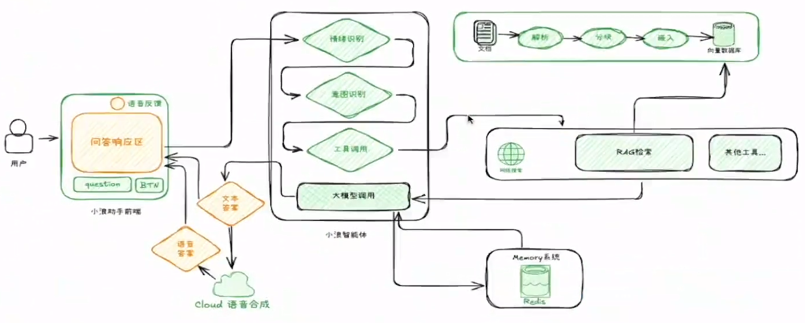
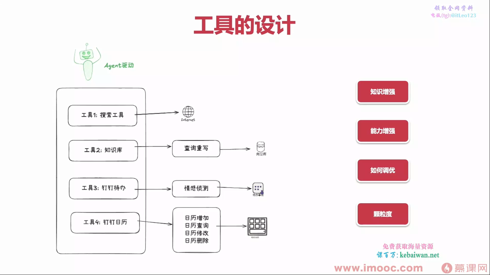
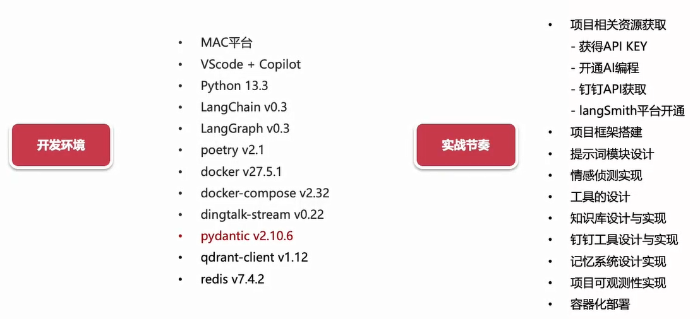

# 魔法猫猫

```
基于 Langchain 的单智能体应用
魔法猫猫是一个基于 LangChain 框架开发的智能 Agent 教学案例，旨在展示如何构建一个具有实际应用价值的 AI 助手。在当前 AI 技术快速迭代的背景下，掌握 Al Agents 开发已成为技术从业者的必备技能。本项目通过实战案例，帮助开发者快速入门 Al Agents 开发领域。
```

🚀 核心功能
```markdown
● 基础 Agent 交互系统
● 基于 RAG (检索增强生成) 的知识库查询
● 实时在线搜索能力
● 钉钉日历与待办事项自然语言交互
● 情绪识别与多轮对话策略
● 智能任务优先级调整
```

## 架构


## 工具设计



## 环境
